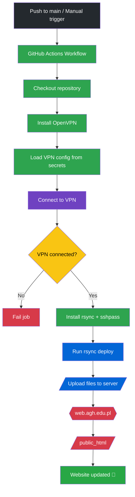
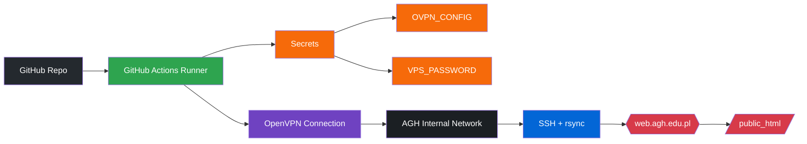

# SKR Argo AGH Website
[argo.agh.edu.pl](https://argo.agh.edu.pl)

> 🚨 To repozytorium wykorzystuje CI/CD (automatyczne wysłanie kodu na serwer - aktualizacja strony) po `git push` na branch `main`. Ta funkcjonalność wymaga certyfikatu `.ovpn`, który wygasa co roku, więc co roku wymaga aktualizacji. Certyfikat przechowywany jest w [Github Secrets](https://github.com/AlexSzczygielski/argo_website/settings/secrets/actions) tego repozytorium. Instrukcja aktualizacji certyfikatu znajduje się w punkcie [🔧 CI/CD](#-cicd).

### Project Status
[](https://github.com/AlexSzczygielski/argo_website/actions/workflows/deploy_website.yaml)
[](https://github.com/AlexSzczygielski/argo_website/commits)
[](https://github.com/AlexSzczygielski/argo_website)
[](https://argo.agh.edu.pl)

A responsive, PHP-based website for **Studencki Klub Regatowy AGH (Argo)** — a student reagtta club promoting competitive sailing and water sports. This project uses modern frontend and backend technologies to deliver a smooth, interactive user experience.

**✍️ Should the original creator no longer be affiliated with the university, please retain his attribution as the first author of this page. Thank You!**
---

## Table of Contents

- [🔧 CI/CD](#-cicd)  
- [🛠 Setup and Deployment](#-setup-and-deployment)  
- [🚀 Technologies Used](#-technologies-used)  
- [📝 Project Structure](#-project-structure)  
- [🔎 Key Components](#-key-components)  
- [🎨 Styling and Responsiveness](#-styling-and-responsiveness)  
- [Dynamic Navigation Bar](#dynamic-navigation-bar)  
- [Smooth Scrolling](#smooth-scrolling)  
- [🔢Versioning](#-versioning)   

---

## 🔧 CI/CD
Website deployment is automated with Github Actions [deploy_website.yaml](.github/workflows/deploy_website.yaml).

The workflow:
- connects to the AGH internal network via VPN
- securely uploads files using rsync over SSH
- deploys content to the `public_html` directory

### CI/CD Maintanance

1. **As `web.agh.edu.pl` server, which hosts our website requires VPN access, we have to allow the GH Actions access to it. The VPN certificate is safely stored inside [Github Secrets](https://github.com/AlexSzczygielski/argo_website/settings/secrets/actions) as `OVPN_CONFIG`. This certifacte has to be updated each year. It is done by obtaining new certificate from [panel.agh.edu.pl](panel.agh.edu.pl) and copying all of it's contents (e.g. `cat certificate_name.ovpn`) into GH secrets OVPN_CONFIG**

2. **Another thing that GH Actions require is VPS password. It is stored under `VPS_PASSWORD` in [Github Secrets](https://github.com/AlexSzczygielski/argo_website/settings/secrets/actions). This should'nt change without explicit user intervetion, however if for some reason it does not work, you have to contact [Pomoc IT AGH](https://cri.agh.edu.pl/pomoc-it) to reset it and update accordingly.**
### CI/CD Workflow Overview



### GH Actions Overview


## 🛠 Setup and Deployment

0. Currently website is auto deployed using CI/CD - please refer to [🔧 CI/CD](#-cicd) section.

1. Open [VPN connection with AGH servers](https://cri.agh.edu.pl/pomoc-it/instrukcje/konfiguracja-polaczenia-vpn).
2. Log into Argo AGH server through SSH protocol 
   ```bash
   ssh argo@web.agh.edu.pl
   ```
   You will be prompted for password - contact [administrator](https://cri.agh.edu.pl/pomoc-it) to reset it or one of founders - Aleksander Szczygielski to access it.

   Alternative would be to set public/private `rsa key` pair.
  
3. Currently web.agh.edu.pl does not grant access to shell commands, so the only possibility is to upload files using `scp` or other `sftp` tools.

7. *AGH servers automatically redirect to public_html/index.php so be sure that landing page is contained in this path*.
8. Verify Boot strap, jQuery, and FontAwesome dependencies are accessible in `plugins/` folder or update links accordingly.
11. ‼️ *If styling does not work, give it some time before trying to make fixes, usually it starts to work on it's own after few hours*

---

## 🚀 Technologies Used

- **PHP** (for server-side templating and dynamic page content)  
- **Bootstrap 5.3** (CSS framework for layout, grid, and components like navbar, carousel)  
- **jQuery 3.7** (DOM manipulation and smooth scrolling animation)  
- **FontAwesome 6** (vector icons for social media links and UI elements)  
- **Google Fonts** (Cinzel, Montserrat, Muli, Inter, Lora) for typography  
- **Custom CSS** for brand styling and transparency effects  

---

## 📝 Project Structure

- `index.php` — Landing page with Jumbotron, About section, and Events carousel  
- `blog/` — Blog posts, should contain only html sections to include in `blog.php`
- `layout/`  
  - `navbar.php` — Dynamic navbar component, loaded on every page  
  - `header.php` — Meta tags, CSS & JS includes, and versioning  
  - `footer.php` — Footer with contact and social icons  
- `css/style.css` — Custom styles, including navbar transparency and scroll effects  
- `plugins/` — Third-party libraries (Bootstrap, jQuery, FontAwesome)  
- `storage/images/` — Static images used throughout the site  

---

## 🔎 Key Components

### Navbar (`layout/navbar.php`)

- Fixed-top, responsive navbar built with Bootstrap 5  
- Adds `navbar-transparent` class dynamically when on the landing page (`index.php`) to show transparent background  
- Changes background on scroll (`scrolled` class toggled with jQuery)  
- Contains smooth scrolling anchor links with offset to prevent overlap from fixed navbar  

### Jumbotron and Sections (`index.php`)

- Large welcome banner using Bootstrap utilities and custom classes  
- Sections with unique IDs for anchor navigation (`#about-anchor`, `#blog-anchor`, etc.)  
- Event carousel showcasing recent and upcoming regatta news using Bootstrap carousel component  

### Footer (`layout/footer.php`)

- Company branding and motto  
- Social media links using FontAwesome icons  
- Responsive layout  

---

## 🎨 Styling and Responsiveness

- Based on Bootstrap’s grid system for responsiveness across devices  
- Custom CSS overrides for branding colors, fonts, and interactive effects  
- Navbar transparency handled via `.navbar-transparent` class on the navbar element itself (see CSS selector `.navbar.navbar-transparent`)  
- Navbar changes background color when scrolled beyond 50px via JavaScript/jQuery  

---

## Dynamic Navigation Bar

- PHP logic removes query parameters to determine active page  
- Applies `.navbar-transparent` class conditionally on landing page only  
- Ensures consistent user experience with colored navbar on internal pages and transparent on the homepage  

---

## Smooth Scrolling

- Implemented using jQuery’s `animate()` to scroll to anchor targets  
- Scroll offset equals navbar height for precise alignment  
- Updates URL hash on animation completion for browser history  

---

## 🔢 Versioning

- Static assets and CSS/JS files include a version query parameter (`?ver=2025.02.04.2`) to enable cache busting  
- `$app_version` variable set in header file for consistent versioning  

---

## 👉 Contributing

- Fork the repo and create feature branches for your changes.  
- Follow existing coding style, especially for PHP templates and CSS.  
- Document new features or changes in your README.  
- Submit pull requests with clear descriptions.
- Keep the style of commenting - especially comment each HTML section and CSS components.  

---

If you have any questions or need help setting up the project, feel free to open an issue!

---

**Created by Aleksander Szczygielski for SKR Argo AGH**  
*Inspired by Ancient Mariners. Driven to Win.*
