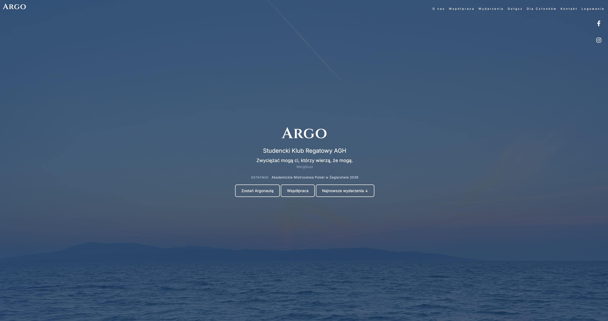
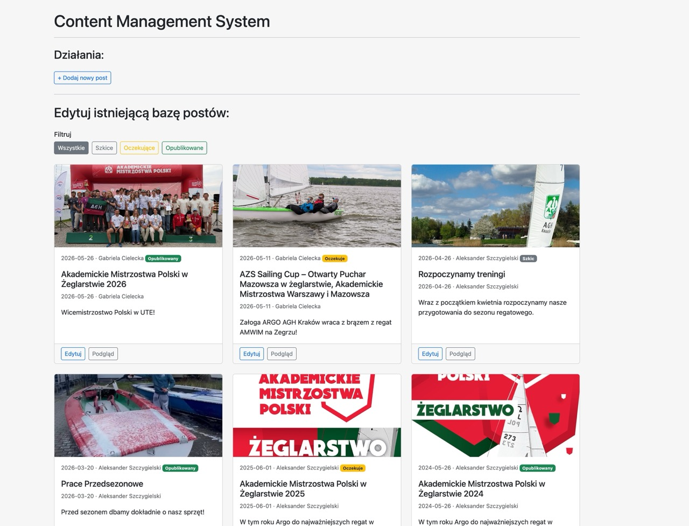
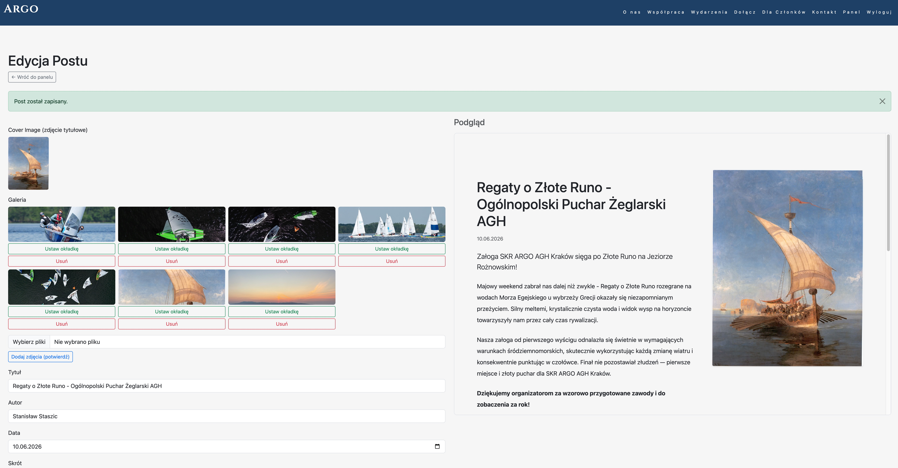
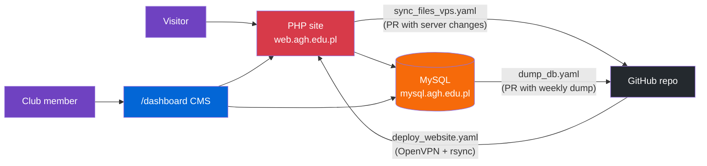
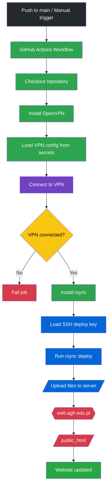

# SKR Argo AGH — Club Website & Custom CMS

**Live site: [argo.agh.edu.pl](https://argo.agh.edu.pl)**

[](https://github.com/AlexSzczygielski/argo_website/actions/workflows/deploy_website.yaml)
[](https://github.com/AlexSzczygielski/argo_website/commits)
[](https://github.com/AlexSzczygielski/argo_website)
[](https://argo.agh.edu.pl)

Production website for **Studencki Klub Regatowy AGH (Argo)** — the AGH University student regatta club — featuring a **custom-built CMS** with role-based publishing, an automated **CI/CD pipeline that deploys through a VPN** into the university network, and a PR-gated content synchronization system between the production server and this repository.

Built and maintained end-to-end as a solo project: frontend, backend, database design, deployment automation, and security.

---

| Landing page | CMS dashboard | Post editor |
|---|---|---|
|  |  |  |

---

## Highlights

- **Custom CMS** (`/dashboard`) written in vanilla PHP — no framework, no page builder:
  - Session-based auth with **bcrypt** password hashing and two user roles (member / admin)
  - Editorial workflow: `draft → pending → published`, with admin approval gating what goes live
  - **Quill** rich-text editor with a live iframe preview rendered through the real site layout
  - Image gallery pipeline: MIME-validated uploads (via `finfo`, not file extension), automatic resize to 1920 px, JPEG conversion, slug-based storage, and cover-image selection
- **MySQL via PDO** — prepared statements everywhere, FK cascade on gallery rows, schema in [`db/schema.sql`](db/schema.sql)
- **CI/CD over VPN** — GitHub Actions connects to the university's internal network via OpenVPN, then deploys with rsync over SSH; four workflows cover deploy, content sync, and DB backup
- **PR-gated reverse sync** — the CMS writes to the production server, and a workflow pulls those changes back into the repo as a pull request, so the CMS never needs git access and nothing reaches `main` unreviewed
- **Automated weekly DB backups** committed via PR, with the `users` table excluded to keep credentials out of version control
- **Security hardening** — path traversal protection (`realpath()` + base path checks), whitelist validation on filters, ownership checks on destructive actions, secrets in GitHub Secrets

---

## Architecture



Both the web server and the database live inside the AGH internal network — every automated job first establishes an OpenVPN tunnel from the GitHub Actions runner.

---

## Tech Stack

| Layer | Technology |
|---|---|
| Backend | PHP (vanilla — server-side templating, sessions, PDO) |
| Database | MySQL (AGH-hosted), schema + ERD in [`db/`](db/README.md) |
| CMS editor | [Quill](https://quilljs.com/) rich-text editor |
| Frontend | Bootstrap 5.3, jQuery 3.7, FontAwesome 6, custom CSS |
| CI/CD | GitHub Actions + OpenVPN + rsync over SSH |
| Tooling | Various local development helper scripts in [`tools/`](tools/README.md) |

---

## Custom CMS

A password-protected admin panel at `/dashboard` replaces the old workflow of hand-writing PHP post files. Members write posts in a rich-text editor with live preview; admins review and publish.

```
Draft → Pending → Published
  ↑         ↓
  └─ reject ─┘
```

Full documentation — file map, user roles, gallery pipeline, and the security model — lives in [`dashboard/README.md`](dashboard/README.md). Database schema, ERD, and data dictionary are in [`db/README.md`](db/README.md).

---

## CI/CD

> 🚨 **Maintainer note:** deployment requires an AGH VPN certificate (`.ovpn`) that **expires annually**. It is stored as `OVPN_CONFIG` in [GitHub Secrets](https://github.com/AlexSzczygielski/argo_website/settings/secrets/actions). To renew: download a new certificate from [panel.agh.edu.pl](https://panel.agh.edu.pl) and paste its contents (`cat certificate_name.ovpn | pbcopy`) into the secret.

Four workflows, documented in detail in [`.github/workflows/README.md`](.github/workflows/README.md):

| Workflow | Trigger | Purpose |
|---|---|---|
| `deploy_website.yaml` | manual / push to `main` | OpenVPN → rsync site to `public_html/` |
| `sync_files_vps.yaml` | manual / `full_sync` | Pull server-side CMS changes into a PR |
| `dump_db.yaml` | manual / `full_sync` | DB dump into a PR (`users` table excluded) |
| `full_sync.yaml` | manual / weekly (Sun 2 am) | Runs both syncs on schedule |

### Secrets

| Secret | Description |
|---|---|
| `OVPN_CONFIG` | AGH VPN certificate — **renew annually** (see note above) |
| `ARGO_DEPLOY_KEY_PRIVATE` | SSH private key for `argo@web.agh.edu.pl`; public key lives in `~/.ssh/authorized_keys` on the server. If deployment fails with an auth error, regenerate the pair (see [Setup](#-setup-and-deployment)) |

### Deploy pipeline



---

## Project Structure

```
├── index.php              # Landing page (jumbotron, about, events carousel)
├── blog.php               # Blog listing — posts fetched from MySQL
├── blog_post.php          # Single post view
├── dashboard/             # Custom CMS panel (see dashboard/README.md)
├── db/                    # PDO connection, schema, ERD (see db/README.md)
├── db_backups/            # Automated SQL dumps (see db_backups/README.md)
├── layout/                # Shared components: navbar, header, footer, post renderer
├── css/style.css          # Custom styles (navbar transparency, branding)
├── js/                    # Frontend scripts
├── plugins/               # Vendored Bootstrap, jQuery, FontAwesome
├── storage/images/        # Uploaded post images (YYYY/post-slug/)
├── tools/                 # Local helper scripts, excluded from deploy
└── .github/workflows/     # CI/CD (see .github/workflows/README.md)
```

---

## Setup and Deployment

Deployment is fully automated — see [CI/CD](#-cicd). Manual access for maintenance:

1. Connect to the [AGH VPN](https://cri.agh.edu.pl/pomoc-it/instrukcje/konfiguracja-polaczenia-vpn).
2. Log into the server via SFTP (no shell access is granted — use `sftp` or `rsync`):

   ```bash
   sftp argo@web.agh.edu.pl
   ```

   Contact the [IT administrator](https://cri.agh.edu.pl/pomoc-it) or the original author (Aleksander Szczygielski) for password access.

3. **SSH key authentication** (recommended, also used to rotate the deploy key):

   ```bash
   # 1. Generate a key pair locally
   ssh-keygen -t ed25519 -C "your-description" -f ~/.ssh/argo_deploy

   # 2. Upload the public key to the server
   cp ~/.ssh/argo_deploy.pub /tmp/authorized_keys
   sftp argo@web.agh.edu.pl
   sftp> put /tmp/authorized_keys .ssh/authorized_keys
   sftp> chmod 600 .ssh/authorized_keys

   # 3. Test the connection (VPN required)
   ssh -i ~/.ssh/argo_deploy argo@web.agh.edu.pl
   ```

### Server quirks

- AGH servers automatically serve `public_html/index.php` — keep the landing page there.
- Database (`mysql.agh.edu.pl`) is reachable **only from the AGH network** — use the VPN or a local MySQL instance for development (see [`BLOG_SQL_MIGRATION.md`](BLOG_SQL_MIGRATION.md#local-development)).
- ‼️ If styling breaks after a deploy, wait a few hours before debugging — server-side caching usually resolves it on its own.
- Verify Bootstrap, jQuery, and FontAwesome are present in `plugins/` or update the links accordingly.

---

## Adding Blog Posts

Posts are created through the CMS at `/dashboard` — see [`dashboard/README.md`](dashboard/README.md) for the full workflow.

---

## Versioning

Static assets use a cache-busting query parameter (`?ver=2025.02.04.2`) controlled by the `$app_version` variable in `layout/header.php`. Bump it after changing CSS/JS.

---

## 👉 Contributing

- Fork the repo and create feature branches for your changes.
- Follow the existing coding style, especially for PHP templates and CSS.
- Keep the commenting style — comment each HTML section and CSS component.
- Submit pull requests with clear descriptions.
- Questions? Open an issue.

---

**Created by Aleksander Szczygielski for SKR Argo AGH**
*Inspired by Ancient Mariners. Driven to Win.*
