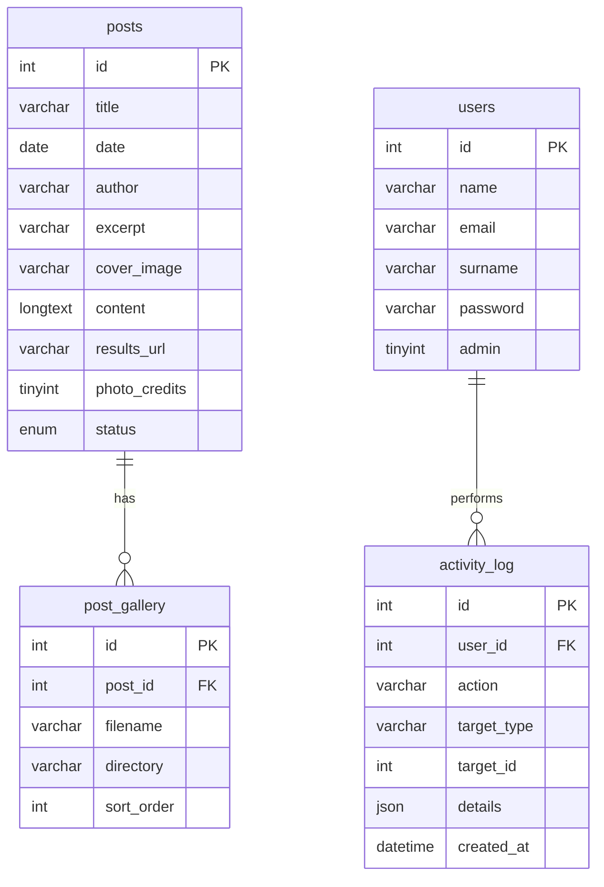

# Database Documentation

MySQL database hosted on AGH server (`mysql.agh.edu.pl`). Access requires AGH network or VPN.

---

## Setup

1. Log into [phpMyAdmin](https://mysql.agh.edu.pl/phpmyadmin)
    1. Uzytkownik: `argo` (production DB) || `argo1` (Development DB)
    2. Hasło: Password can be accessed through *[panel.agh.edu.pl](https://panel.agh.edu.pl)*
        > **Do not reset the password** - this will crash production!
2. Select the `argo` database
3. Go to the **SQL** tab
4. Paste the contents of `schema.sql` and execute
5. To restore data, run `db_backups/data.sql`

---

## Entity Relationship Diagram



---

## Data Dictionary

### `posts`

| Column | Type | Nullable | Default | Description |
|--------|------|----------|---------|-------------|
| `id` | INT AUTO_INCREMENT | No | — | Primary key, auto-assigned |
| `title` | VARCHAR(255) | No | — | Post title |
| `date` | DATE | No | — | Publication date (`YYYY-MM-DD`) |
| `author` | VARCHAR(255) | Yes | NULL | Author name. NULL renders as "ARGO" |
| `excerpt` | VARCHAR(255) | Yes | NULL | Short summary shown on blog listing cards |
| `cover_image` | VARCHAR(255) | Yes | NULL | Relative path to cover image, e.g. `storage/images/2026/amp/podium_1.JPG` |
| `content` | LONGTEXT | Yes | NULL | Full post body as HTML. Rendered raw in `blog_post.php` |
| `results_url` | VARCHAR(255) | Yes | NULL | Public Upwind24 regatta URL. If set, triggers JS results table via `upwind_api.js` |
| `photo_credits` | TINYINT(1) | Yes | 0 | `1` = show "Zdjęcia dzięki uprzejmości organizatora." footer. `0` = hide |
| `status` | ENUM | Yes | `draft` | Post visibility: `draft` = private, `pending` = awaiting admin approval, `published` = public |

### `post_gallery`

| Column | Type | Nullable | Default | Description |
|--------|------|----------|---------|-------------|
| `id` | INT AUTO_INCREMENT | No | — | Primary key, auto-assigned |
| `post_id` | INT | No | — | Foreign key → `posts.id`. Cascade deletes on post removal |
| `filename` | VARCHAR(255) | No | — | Image filename, e.g. `podium_1.JPG` |
| `directory` | VARCHAR(255) | No | — | Relative directory path, e.g. `storage/images/2026/amp` |
| `sort_order` | INT | No | — | Display order. Lower = earlier in gallery |

Full image path is constructed as `directory/filename` at render time.

### `users`

| Column | Type | Nullable | Default | Description |
|--------|------|----------|---------|-------------|
| `id` | INT AUTO_INCREMENT | No | — | Primary key, auto-assigned |
| `name` | VARCHAR(255) | Yes | NULL | First name |
| `email` | VARCHAR(255) | No | — | Login identifier. Must be unique |
| `surname` | VARCHAR(255) | Yes | NULL | Last name |
| `password` | VARCHAR(255) | No | — | bcrypt hash via PHP `password_hash()`. Never plain text |
| `admin` | TINYINT(1) | Yes | 0 | `1` = admin access, `0` = no access |

**`users` table is excluded from automated DB dumps for security. Manage users manually via phpMyAdmin.**

### `activity_log`

Append-only audit trail of actions performed in the CMS panel. Written by `dashboard/activity_log.php` (`log_action()`); read by `dashboard/activity_feed.php` (admin-only paginated view).

| Column | Type | Nullable | Default | Description |
|--------|------|----------|---------|-------------|
| `id` | INT AUTO_INCREMENT | No | — | Primary key, auto-assigned |
| `user_id` | INT | Yes | NULL | FK → `users.id`. `ON DELETE SET NULL` so logs survive user deletion |
| `action` | VARCHAR(40) | No | — | Dotted-string event name, e.g. `auth.login.success`, `post.submit_for_review`, `gallery.delete` |
| `target_type` | VARCHAR(20) | Yes | NULL | Type of affected entity (`post`, `gallery`, `auth`). Derived from `action` prefix by the helper |
| `target_id` | INT | Yes | NULL | ID of the affected entity. No FK — audit entries must survive entity deletion |
| `details` | JSON | Yes | NULL | Free-form context (attempted email on failed login, upload counts, from/to status on revert, etc.) |
| `created_at` | DATETIME | Yes | `CURRENT_TIMESTAMP` | When the action occurred |

Indexed on `created_at` (timeline queries) and `user_id` (per-user history).

**Privacy:** no IP addresses, no name snapshots. When a user is deleted, the FK `SET NULL` clears their `user_id` automatically — log entries become anonymous "(usunięty użytkownik)" in the feed. Disclosed in `prywatnosc.php` §2, §3, §5.

**`activity_log` is excluded from automated DB dumps** — audit trail isn't needed in backups and would otherwise need PII scrubbing on every user deletion.

---

## Files

| File | Tracked | Purpose |
|------|---------|---------|
| `schema.sql` | ✅ | Table definitions — run once on setup or when structure changes |
| `db_config.php` | ✅ | DB host, name, user — no secrets |
| `db_passwd.php` | ❌ | Defines `DB_PASS` — gitignored, generated by GitHub Actions in production |
| `db.php` | ✅ | `get_pdo()` — reusable PDO connection function |
| `db_backups/data.sql` | ✅ | Latest DB dump — updated automatically via `dump_db.yaml` workflow |

---

## Migration History

| Date | Change |
|------|--------|
| 2026-06 | Initial schema: `posts` table created |
| 2026-06 | Added `post_gallery` table with FK cascade |
| 2026-06 | `ALTER TABLE posts ADD COLUMN results_url VARCHAR(255)` |
| 2026-06 | `ALTER TABLE posts CHANGE image cover_image VARCHAR(255)` |
| 2026-06 | `ALTER TABLE posts MODIFY COLUMN author VARCHAR(255) NULL` |
| 2026-06 | `ALTER TABLE posts ADD COLUMN photo_credits TINYINT(1) DEFAULT 0` |
| 2026-06 | Added `users` table for admin authentication |
| 2026-06 | `ALTER TABLE posts ADD COLUMN status ENUM('draft','pending','published') DEFAULT 'draft'` |
| 2026-06 | `UPDATE posts SET status = 'published'` — migrated existing posts |
| 2026-06 | Added `activity_log` table with FK `user_id → users(id) ON DELETE SET NULL` for CMS audit trail |

---

## Local Development

`db_passwd.php` is gitignored. Create it manually for local dev:

```php
<?php define('DB_PASS', 'your_password'); ?>
```

The AGH MySQL server is only reachable from the AGH network. To work remotely connect via AGH VPN.

A separate `argo1` database exists on `mysql.agh.edu.pl` for local testing. `db_config.php` automatically selects it when `APP_ENV` is not set to `production`. Schema and data can be restored from `schema.sql` and `db_backups/data.sql` — disable foreign key checks during import.

---

## Production Deploy

`db_passwd.php` is generated automatically by GitHub Actions from the `DB_PASS` secret before rsync. No manual step needed.